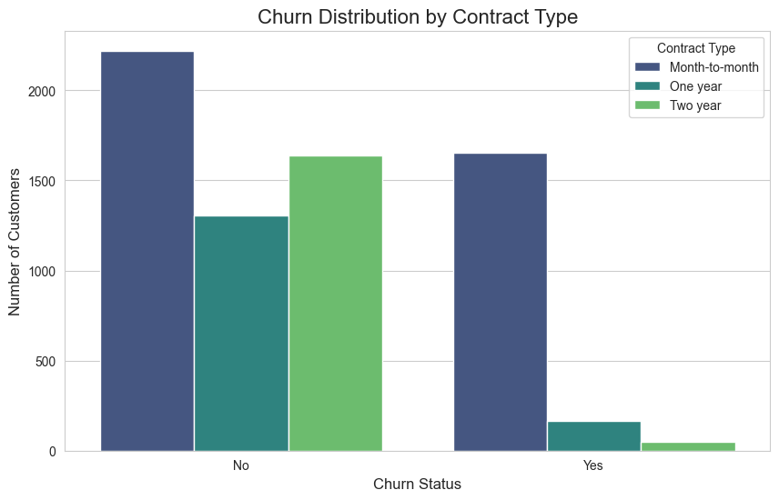

# Telco Customer Churn Analysis and Prediction
# Predicting Customer Churn

### The Business Problem: Why Do Good Customers Leave?

Every business wants to keep its customers happy. But sometimes, customers leave (or "churn"), and acquiring a new customer is far more expensive than retaining an existing one. This project tackles this core business problem by diving into a dataset from a fictional telecom company.

My goal was to answer two key questions:
1.  **Why** are customers churning? What are the main drivers and pain points?
2.  **Who** is most likely to churn next? Can we build a tool to predict at-risk customers proactively?

---
### My Process: From Raw Data to Actionable Insights

I followed a standard data analytics workflow to move from a messy dataset to clear, actionable recommendations:
1.  **Exploratory Data Analysis (EDA):** I first explored the data visually to understand the characteristics of customers who churn versus those who stay.
2.  **Data Preprocessing:** I cleaned and transformed the data, converting all features into a numerical format ready for machine learning.
3.  **Predictive Modeling:** I built a Logistic Regression model to predict the likelihood of a customer churning.
4.  **Evaluation & Interpretation:** I evaluated the model's performance not just on accuracy, but on its real-world value in identifying at-risk customers.

---
### Key Findings: What Drives a Customer to Leave? 

My analysis uncovered several clear patterns that signal a high risk of churn:

* **Contracts are a Commitment:** Customers on flexible **month-to-month contracts** are far more likely to leave compared to those on one or two-year contracts. The lack of a long-term commitment makes the decision to switch much easier.

* **The Double-Edged Sword of Fiber Optics:** While a premium service, customers with **Fiber optic internet** churned at a surprisingly high rate. This suggests there might be issues with the service's price, reliability, or the customer support associated with it.

* **The Honeymoon Phase is Risky:** The analysis clearly showed that **new customers** (those with low tenure) are the most likely to churn. The first few months are a critical period for ensuring customer satisfaction and building loyalty.

* **Support Matters:** Customers who did not have technical add-ons like **Online Security** and **Tech Support** were significantly more likely to churn, indicating that a lack of a support safety net is a major factor.

---
### Building a Predictive Tool 

To move from insight to action, I built a predictive model to flag at-risk customers.

* The model achieved an overall accuracy of **79%**.
* More importantly, I focused on its **Recall** for the "Churn" class, which was **51%**. This means the model successfully identified **half of all the customers who were actually going to churn**, providing the business with a powerful, data-driven list for proactive intervention.

---
### My Recommendations for the Business 

Based on this analysis, I propose the following data-driven strategies:

1.  **Target the High-Risk Segment:** Focus retention efforts on **new customers with month-to-month contracts and fiber optic service.** A proactive offer to switch to a discounted annual plan could be highly effective in "locking in" their loyalty.

2.  **Use the Model as a Smart Starting Point:** Deploy the model to generate a weekly list of customers with a high probability of churning. While it won't catch everyone, it allows the marketing and support teams to focus their efforts where they're needed most.

3.  **Investigate the Fiber Optic Experience:** Conduct surveys or follow-up calls with fiber optic customers to understand their pain points. The high churn rate suggests a mismatch between the service's promise and the customer's experience.

---
### Technical Details

* **Environment:** Python, JupyterLab
* **Libraries:** Pandas (for data manipulation), Matplotlib & Seaborn (for visualization), Scikit-learn (for modeling)
